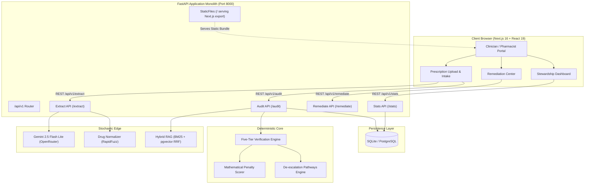

# AMR-Guard

> **Deterministic Clinical Prescription Auditing & Antimicrobial Stewardship Platform**  
> *Grounded in ICMR Standard Treatment Guidelines, WHO AWaRe Classification (2023), and ICMR-AMRSN Surveillance Data.*

[](https://python.org)
[](https://fastapi.tiangolo.com)
[](https://nextjs.org)
[](https://react.dev)
[](https://www.typescriptlang.org)
[](https://tailwindcss.com)
[](#-testing--architectural-conformance)
[](LICENSE)

---

## 📑 Table of Contents

1. [Executive Summary & Problem Statement](#-executive-summary--problem-statement)
2. [Architectural Philosophy: Stochastic Edge, Deterministic Core](#-architectural-philosophy-stochastic-edge-deterministic-core)
3. [The Five-Tier Verification Rule Pipeline](#-the-five-tier-verification-rule-pipeline)
4. [Mathematical Scoring & Triage Model](#-mathematical-scoring--triage-model)
5. [Key Platform Features](#-key-platform-features)
6. [Technology Stack](#-technology-stack)
7. [System Architecture & Data Flow](#-system-architecture--data-flow)
8. [Directory Structure](#-directory-structure)
9. [Quickstart & Setup](#-quickstart--setup)
10. [Running the Application](#-running-the-application)
11. [Testing & Architectural Conformance](#-testing--architectural-conformance)
12. [API Reference & Verification Examples](#-api-reference--verification-examples)
13. [Clinical Evidence Base & Citations](#-clinical-evidence-base--citations)

---

## 🏥 Executive Summary & Problem Statement

Outpatient clinical care represents over **80% of total human antimicrobial consumption**, yet studies consistently show that **up to 50% of outpatient antibiotic prescriptions are clinically inappropriate**:

* **Empiric Over-Escalation:** Routine prescription of high-potency "Watch" and "Reserve" group antibiotics (*Cefixime, Azithromycin, Levofloxacin*) for mild, uncomplicated infections where narrow-spectrum "Access" agents (*Amoxicillin, Nitrofurantoin*) are standard of care.
* **Viral / Self-Limiting Prescribing:** Inappropriate antimicrobial therapy for conditions such as the common cold, acute viral bronchitis, and acute watery diarrhea.
* **Irrational Fixed-Dose Combinations (FDCs):** Widespread dispensing of irrational dual-antimicrobials (e.g., *Ofloxacin + Ornidazole*, *Cefixime + Azithromycin*) despite national regulatory bans.
* **Empiric Resistance Traps:** Prescribing empirical antibiotics against pathogens with widespread endemic resistance (e.g., fluoroquinolones for urinary tract infections despite **>75% *E. coli* resistance** documented by ICMR surveillance).
* **Life-Threatening Contraindications:** Overlooking patient safety gates, including fluoroquinolone arthropathy in pediatric patients, tetracyclines during pregnancy, and nitrofurantoin toxicity in geriatric renal impairment.

**AMR-Guard** solves this by providing a high-speed, mathematically bounded prescription auditing engine that evaluates outpatient prescriptions in real time, generates actionable de-escalation pathways, and empowers healthcare institutions to meet WHO antimicrobial stewardship targets.

---

## 🏛 Architectural Philosophy: "Stochastic Edge, Deterministic Core"

Clinical decision safety **cannot tolerate LLM hallucinations, probabilistic scoring drift, or unpredictable non-deterministic outputs**. AMR-Guard enforces a strict architectural boundary verified at build time via Python AST analysis ([tests/test_architecture.py](tests/test_architecture.py)):

```
┌─────────────────────────────────────────────────────────────────────────────┐
│                              STOCHASTIC EDGE                                │
│       (LangGraph • OpenRouter / Gemini 2.5 • LlamaIndex • RapidFuzz)        │
│                                                                             │
│  • Multimodal OCR on doctor prescriptions, handwritten notes, and PDFs     │
│  • Normalization of trade brand names (e.g. Augmentin, Cifran) to INN      │
│  • Extraction of patient demographics, eGFR, pregnancy, and comorbidities   │
│  • Hybrid RAG literature retrieval (Dense pgvector + Sparse BM25 + RRF)     │
└──────────────────────────────────────┬──────────────────────────────────────┘
                                       │ Strictly Validated ContextBundle (Pydantic v2)
                                       ▼
┌─────────────────────────────────────────────────────────────────────────────┐
│                             DETERMINISTIC CORE                              │
│                      (Pure Python Engine • Zero LLMs)                       │
│                                                                             │
│  • Hard safety gates & absolute contraindications (Tier 1)                 │
│  • Indication legitimacy & CDSCO banned FDC filter (Tier 2)                 │
│  • WHO AWaRe spectrum de-escalation checks (Tier 3)                        │
│  • ICMR therapeutic duration limits (Tier 4)                                │
│  • ICMR-AMRSN endemic pathogen resistance benchmarking (Tier 5)             │
│  • Mathematically bounded penalty formula: AMR_Risk_Score = min(100, ...)   │
└──────────────────────────────────────┬──────────────────────────────────────┘
                                       │
                                       ▼
┌─────────────────────────────────────────────────────────────────────────────┐
│                           AUDIT & TRIAGE DECISION                           │
│               [BLOCKED (Red) • FLAGGED (Amber/Red) • APPROVED (Green)]       │
│               Evidence-based 1-click remediation & de-escalation pathways   │
└─────────────────────────────────────────────────────────────────────────────┘
```

1. **Stochastic Edge (`app/agents/`):** Utilizes multimodal AI and hybrid lexical/vector search solely to digest messy real-world inputs (handwriting, trade brands, diagnostic notes) and normalize them into structured generic entities.
2. **Deterministic Core (`app/engine/`):** Pure-Python rules engine that evaluates clinical gates deterministically with algebraic guarantees. **Never imports AI or LLM SDKs**.
3. **Graceful Offline Fallback:** If LLM APIs are unreachable or offline, the system seamlessly activates local regex heuristics and database lookups without downtime.

---

## 🛡 The Five-Tier Verification Rule Pipeline

Prescriptions are processed sequentially through five evidence-based clinical gates ([app/engine/rules.py](app/engine/rules.py)):

| Tier | Verification Gate | Clinical Condition Checked | Engine Action & Penalty | Official Evidence Base |
| :---: | :--- | :--- | :---: | :--- |
| **1** | **Pediatric Contraindication** | Patient age $< 18$ years prescribed Fluoroquinolones or Tetracyclines | **`BLOCKED`** ($Score = 100.0$)<br>Zero-tolerance hard stop | ICMR Pediatric STG & FDA Warnings (arthropathy & dental enamel hypoplasia) |
| **1** | **Pregnancy Safety Gate** | Patient pregnant prescribed FDA Category D/X or toxic antimicrobials | **`BLOCKED`** ($Score = 100.0$)<br>Zero-tolerance hard stop | FDA Pregnancy Classifications & WHO Clinical Guidelines |
| **1** | **Geriatric / Renal Nitrofurantoin Gate** | Age $\ge 65$ years OR documented $\text{eGFR} < 30 \text{ mL/min}$ | **`BLOCKED`** ($Score = 100.0$)<br>Zero-tolerance hard stop | Beers Criteria (2023) & ICMR Geriatric Guidelines (inadequate urinary conc. / toxicity) |
| **1** | **Mandatory Renal Function Hold** | Narrow-therapeutic nephrotoxics prescribed with missing or low eGFR | **`BLOCKED`** ($Score = 100.0$)<br>Zero-tolerance hard stop | KDIGO Guidelines & Therapeutic Drug Monitoring (TDM) Standards |
| **1** | **Documented Drug Allergy Stop** | Prescribing drug with documented patient allergy or same-class reaction | **`BLOCKED`** ($Score = 100.0$)<br>Zero-tolerance hard stop | FDA Monograph Warnings & British National Formulary (BNF) |
| **1** | **Fatal Comorbidity Clashes** | Severe drug-disease clashes (e.g. Myasthenia Gravis + FQs, G6PD + Nitrofurantoin) | **`BLOCKED`** ($Score = 100.0$)<br>Zero-tolerance hard stop | FDA Black Box Warnings & Clinical Monograph Standards |
| **2** | **Viral / Self-Limiting Infection Gate** | Antibiotic prescribed for acute bronchitis, common cold, viral URTI, or acute watery diarrhea | Penalty: $P_{\text{indication}} = 100$<br>Mandate supportive care | ICMR STG Common Infections & WHO Essential Medicines List |
| **2** | **Banned / Irrational FDC Filter** | Prescribing irrational dual-antibiotic combinations (*Ofloxacin + Ornidazole*, *Cefixime + Azithromycin*) | Flagged as *"Not Recommended"*<br>Mandate single-agent switch | CDSCO Banned FDC Gazette & ICMR National Action Plan |
| **2** | **Beta-Lactam Cross-Reactivity** | Patient with penicillin allergy prescribed cephalosporins or carbapenems | Tier 2 Warning Flag<br>Highlight cross-reactivity risk | Joint Task Force on Practice Parameters (JTFPP) |
| **3** | **Watch-Group Over-Escalation** | Empirical "Watch" antibiotic prescribed when guideline "Access" alternative exists | Penalty: $P_{\text{class}} = 45$<br>Recommend de-escalation | WHO AWaRe Classification Framework (2023) |
| **3** | **Reserve-Group "Air-Gap"** | Outpatient empirical use of "Reserve" antibiotics (*Meropenem, Linezolid, Colistin*) without culture ID | Penalty: $P_{\text{class}} = 85$<br>Mandate ID specialist sign-off | WHO Reserve Group Stewardship Protocol |
| **4** | **Therapeutic Course Duration Limits** | • Mild CAP duration $> 5$ days<br>• Lower UTI Nitrofurantoin $> 5$ days or Fosfomycin $> 1$ day | Penalty:<br>$P_{\text{duration}} = (\Delta \text{days}) \times 15$ | ICMR STG Respiratory & Urological Guidelines |
| **5** | **Endemic Pathogen Resistance Benchmarking** | Fluoroquinolones prescribed empirically for uncomplicated cystitis | High Clinical Failure Alert<br>Recommend Nitrofurantoin / Fosfomycin | ICMR-AMRSN Annual Surveillance Data (**>75% *E. coli* resistance**) |

---

## 🧮 Mathematical Scoring & Triage Model

When no Tier 1 hard contraindication is tripped, the prescription's risk is calculated algebraically ([app/engine/scoring.py](app/engine/scoring.py)):

$$\text{AMR\_Risk\_Score} = \min\left(100.0, \; 0.4 \cdot P_{\text{class}} + 0.2 \cdot P_{\text{duration}} + 0.4 \cdot P_{\text{indication}}\right)$$

### Stewardship Triage Bands

| Risk Band | Score Range | Audit Status | Clinical Interpretation & Action Required |
| :---: | :---: | :---: | :--- |
| **GREEN** | **$0.0 - 34.9$** | `APPROVED` | **Compliant Regimen:** Adheres to first-line Access antimicrobials, recommended duration, and verified bacterial indication. |
| **AMBER** | **$35.0 - 74.9$** | `FLAGGED` | **Moderate Risk:** Over-escalation to Watch-group antimicrobials or excessive duration. Clinician review and de-escalation advised. |
| **RED** | **$75.0 - 100.0$** | `FLAGGED` or `BLOCKED` | **Critical Non-Compliance or Hard Stop:** Reserve-tier outpatient prescribing, antibiotic for viral syndrome, or any Tier 1 contraindication tripped. Dispensing held. |

---

## 🌟 Key Platform Features

* **Multimodal Prescription Intake:** Accepts raw text doctor notes, structured inputs, PDF uploads, or photographed prescriptions via Gemini multimodal OCR.
* **Intelligent Drug Normalization:** Maps over 50+ common Indian trade brand names (*Augmentin*, *Clavam*, *Ciplox*, *Zifi*, *Azee*, *Monocef*) and misspellings to canonical INN generics using RapidFuzz.
* **Instant Verification Engine:** Sub-200ms deterministic evaluation returning visual risk gauges, penalty breakdowns, and exact clinical citations.
* **Clinical Remediation Center:** One-click evidence-based remedies:
  * *De-escalate Drug:* Switch broad-spectrum Watch antibiotics to first-line Access agents.
  * *Cap Duration:* Truncate extended regimens to guideline limits.
  * *Supportive Therapy:* Substitute antimicrobials for viral illnesses with ORS, Zinc, or Paracetamol.
  * *Retain with Rationale:* Formal clinical override workflow with recorded physician justification.
  * *Signed Audit Certificates:* Client-side downloadable PDF reports generated via jsPDF.
* **Stewardship Analytics Dashboard:** Institutional metrics tracking overall audits, pass/blocked ratios, and real-time WHO AWaRe consumption percentages (targeting the WHO goal of $\ge 60\%$ Access).
* **Clinical Guidelines Explorer:** Filterable reference database covering WHO AWaRe 2023 categorizations, CDSCO banned fixed-dose combinations, and ICMR outpatient disease protocols.

---

## 💻 Technology Stack

| Layer | Technologies & Frameworks | Description |
| :--- | :--- | :--- |
| **Frontend** | Next.js 16 (App Router), React 19, TypeScript, Tailwind CSS v4, Lucide Icons, Recharts, Zustand | High-performance clinical UI; compiles to static export (`output: 'export'`) served directly by the backend. |
| **Backend & API** | FastAPI, Uvicorn, Pydantic v2, Python 3.10+ | Asynchronous REST service with interactive OpenAPI docs (`/docs`). |
| **Database & ORM** | SQLAlchemy 2.x, PostgreSQL with `pgvector`, SQLite | Dual-mode persistence: zero-config local SQLite (`amrguard.db`) and PostgreSQL for vector embeddings. |
| **Stochastic Edge** | LangGraph, OpenRouter, Google Gemini 2.5 Flash Lite, LlamaIndex, `rank_bm25`, RapidFuzz | Multimodal OCR, entity normalization, and Reciprocal Rank Fusion (RRF $k=60$) guideline retrieval. |
| **Deterministic Core** | Pure Python Standard Library | Five-Tier verification rules and algebraic scoring with zero AI imports. |
| **Testing & QA** | Pytest, HTTPX, Python AST Conformance | 56+ automated tests covering rule logic, API endpoints, RRF reranking, and architectural integrity. |

---

## 📐 System Architecture & Data Flow



---

## 📁 Directory Structure

```
amr-guard/
├── app/
│   ├── agents/            # Stochastic Edge: OCR extraction, normalizer, RRF reranker, LangGraph
│   │   ├── extraction.py  # Multimodal & text parsing agent
│   │   ├── normalizer.py  # Brand-to-INN generic resolution with RapidFuzz
│   │   ├── rag_audit.py   # Hybrid RAG-first clinical audit orchestrator
│   │   └── reranker.py    # Reciprocal Rank Fusion (BM25 + Vector) engine
│   ├── api/v1/            # FastAPI REST endpoints
│   │   ├── audit.py       # Prescription audit endpoint (/api/v1/audit)
│   │   ├── extract.py     # Document & text entity extraction endpoint (/api/v1/extract)
│   │   ├── remediate.py   # Clinical de-escalation & alternative regimens (/api/v1/remediate)
│   │   ├── stats.py       # AWaRe distribution & surveillance metrics (/api/v1/stats)
│   │   ├── knowledge.py   # Guideline literature query endpoint (/api/v1/knowledge)
│   │   └── prescriptions.py# Case persistence and retrieval (/api/v1/prescriptions)
│   ├── core/              # Global configuration & environment settings
│   ├── db/                # SQLAlchemy models (Drug, Brand, Condition, Guideline, Audit)
│   ├── engine/            # Deterministic Core (Pure Python rules & scoring)
│   │   ├── constraints.py # Controlled clinical vocabularies & drug sets
│   │   ├── rule_registry.py# Registry of clinical validation rules
│   │   ├── rules.py       # Five-Tier deterministic logic (Zero LLM imports)
│   │   ├── scoring.py     # Bounded mathematical penalty calculation
│   │   └── remediation.py # De-escalation & supportive care generator
│   ├── schemas/           # Pydantic v2 data models & request/response schemas
│   └── main.py            # FastAPI entrypoint & static mount
├── data/
│   └── seed/              # Clinical seed datasets (drugs.csv, brands.csv, guidelines.csv, regimens.csv)
├── docs/                  # Specs: tech-stack.md, rules-spec.md, REQUIREMENTS.md, architecture.md
├── frontend/              # Next.js 16 (React 19, TypeScript, Tailwind v4)
│   └── src/
│       ├── app/           # App router pages: dashboard, prescriptions, remediation, guidelines, history
│       ├── components/    # Reusable UI, gauges, tables, upload modals, stepper
│       └── store/         # Zustand global state stores
├── scripts/               # Seed scripts, knowledge ingestion, gold-standard benchmark runners
├── tests/                 # 56+ tests: unit, integration, RAG re-ranking, and AST boundary validation
├── Makefile               # GNU Make task runner recipes
├── run.ps1                # PowerShell automation runner for Windows
├── run.md                 # Detailed operational guide & run reference
└── requirements.txt       # Python dependencies
```

---

## 🚀 Quickstart & Setup

### Prerequisites
* **Python**: 3.10 or higher (`python --version`)
* **Node.js**: 18.0 or higher with npm (`node --version`, `npm --version`)
* **Database**: Local SQLite (built-in, zero-setup default) or PostgreSQL with `pgvector`

### 1. Environment Setup

Copy the example environment configuration:

```bash
cd amr-guard
cp .env.example .env
```

Configure your `.env` variables:

```ini
# Database Connection (SQLite local default, or PostgreSQL with pgvector)
DATABASE_URL=sqlite:///./amrguard.db

# Optional: OpenRouter / Gemini API Key for Stochastic Edge parsing
OPENROUTER_API_KEY=your_openrouter_api_key_here
OPENROUTER_MODEL=google/gemini-2.5-flash-lite

# Environment Mode (dev or prod)
APP_ENV=dev
```

> **Note:** AMR-Guard functions completely offline using its deterministic core and regex normalizers even if no `OPENROUTER_API_KEY` is provided.

### 2. Dependency Installation

**Option A: Using Windows PowerShell Runner (`run.ps1`)**
```powershell
.\run.ps1 install
```

**Option B: Using GNU Make (Linux / macOS / Git Bash)**
```bash
make install
```

**Option C: Manual Installation**
```powershell
# 1. Setup Python Virtual Environment
python -m venv .venv
.\.venv\Scripts\activate

# 2. Install Python Dependencies
pip install -r requirements.txt

# 3. Install Frontend Dependencies
cd frontend
npm install
cd ..
```

### 3. Database Seeding

Populate the database with the clinical formulary, ICMR guidelines, and Indian brand catalogs:

```powershell
# Windows
.\run.ps1 seed

# Linux / Make
make seed
```

*(Manual alternative: `python scripts/seed_db.py`)*

---

## 🏃 Running the Application

### Development Mode (Separate Terminals)

In development mode, both the FastAPI server and Next.js dev server run with hot-reloading enabled. Next.js automatically proxies `/api/v1/*` calls to the backend.

**Terminal 1: Backend API Server**
```bash
# Windows
.\.venv\Scripts\activate
uvicorn app.main:app --reload --port 8000

# Make / Linux
make dev-backend
```
* Backend API: `http://localhost:8000`
* Interactive OpenAPI Docs: `http://localhost:8000/docs`

**Terminal 2: Frontend Web Application**
```bash
# Windows
cd frontend
npm run dev

# Make / Linux
make dev-frontend
```
* Frontend Web App: `http://localhost:3000`

---

### Production / Monolith Mode (Single Server)

AMR-Guard can be compiled into a unified monolith where FastAPI directly serves both the REST API and the static Next.js export on a single port:

```bash
# Windows
.\run.ps1 run

# Make / Linux
make run
```

*(Manual commands: `cd frontend && npm run build && cd .. && uvicorn app.main:app --host 0.0.0.0 --port 8000`)*

* **Unified Application:** `http://localhost:8000`

---

## 🧪 Testing & Architectural Conformance

The test suite validates clinical decision accuracy, RRF reranking, API contracts, and architectural conformance:

```bash
# Run all 56 tests
pytest

# Verbose output
pytest -v
```

### Targeted Test Suites

```bash
# 1. AST Architectural Conformance (Ensures Engine NEVER imports LLMs or AI SDKs)
pytest tests/test_architecture.py

# 2. Five-Tier Verification Rules & Clinical Gates
pytest tests/test_rules.py tests/test_scoring.py tests/test_allergy_rules.py

# 3. Hybrid RRF (Reciprocal Rank Fusion) Re-ranking
pytest tests/test_reranker.py

# 4. End-to-End Backend REST API Endpoints
pytest tests/test_backend_api.py
```

### Running the Clinical Gold-Standard Benchmark

Evaluate the deterministic engine against 12 gold-standard clinical case studies derived from ICMR STG protocols:

```bash
python scripts/eval_benchmark.py
```

---

## 📡 API Reference & Verification Examples

Interactive API documentation and schema models are available at `http://localhost:8000/docs`.

### Core API Endpoints

| Endpoint | Method | Description |
| :--- | :---: | :--- |
| `/api/v1/health` | `GET` | Service liveness and operational health status. |
| `/api/v1/extract` | `POST` | Normalizes unstructured clinical notes or uploaded documents into structured entities. |
| `/api/v1/audit` | `POST` | Executes Five-Tier clinical verification on a patient and prescription. |
| `/api/v1/remediate` | `POST` | Generates evidence-based de-escalation substitutions and supportive therapies. |
| `/api/v1/stats` | `GET` | Institutional stewardship metrics, AWaRe distribution, and surveillance benchmarks. |
| `/api/v1/knowledge` | `GET` | Hybrid RAG search across ICMR treatment guidelines and drug monographs. |
| `/api/v1/prescriptions` | `GET` / `POST` | Persistent prescription case history management. |

---

### Example 1: Pediatric Fluoroquinolone Hard Contraindication (Tier 1)

**Request:**
```bash
curl -X POST http://127.0.0.1:8000/api/v1/audit/ \
  -H "Content-Type: application/json" \
  -d '{
    "patient": {
      "age_years": 14,
      "sex": "M",
      "is_pregnant": false
    },
    "prescription_lines": [
      { "drug_name": "Ciprofloxacin", "duration_days": 5 }
    ],
    "canonical_syndrome": "SYN_UNCOMPLICATED_UTI",
    "is_outpatient": true
  }'
```

**Response (`BLOCKED` - Zero Tolerance Hard Stop):**
```json
{
  "status": "BLOCKED",
  "score": 100.0,
  "band": "RED",
  "penalties": {
    "p_class": 0.0,
    "p_duration": 0.0,
    "p_indication": 0.0
  },
  "flags": [
    {
      "tier": 1,
      "rule_id": "TIER1_PEDIATRIC_CONTRAINDICATION",
      "severity": "BLOCKED",
      "penalty_score": 100.0,
      "drug": "Ciprofloxacin",
      "rationale": "Patient age 14 < 18 years. Fluoroquinolones carry high risk of irreversible musculoskeletal/cartilage damage (arthropathy).",
      "citation": "ICMR Pediatric Guidelines & FDA Black Box Warning"
    }
  ],
  "remediation_options": [
    {
      "rule_id": "TIER1_PEDIATRIC_CONTRAINDICATION",
      "recommendation_type": "SWITCH_DRUG",
      "suggested_action": "Discontinue Ciprofloxacin immediately. Switch to pediatric-safe first-line agent (e.g., Amoxicillin-Clavulanate or Cefixime if indicated).",
      "clinical_rationale": "Avoid irreversible articular cartilage toxicity in pediatric patients."
    }
  ]
}
```

---

### Example 2: Clean First-Line Compliant Prescription

**Request:**
```bash
curl -X POST http://127.0.0.1:8000/api/v1/audit/ \
  -H "Content-Type: application/json" \
  -d '{
    "patient": {
      "age_years": 32,
      "sex": "M",
      "is_pregnant": false
    },
    "prescription_lines": [
      { "drug_name": "Amoxicillin", "duration_days": 5 }
    ],
    "canonical_syndrome": "SYN_CAP_MILD",
    "is_outpatient": true
  }'
```

**Response (`APPROVED` - Compliant Regimen):**
```json
{
  "status": "APPROVED",
  "score": 0.0,
  "band": "GREEN",
  "penalties": {
    "p_class": 0.0,
    "p_duration": 0.0,
    "p_indication": 0.0
  },
  "flags": [],
  "remediation_options": []
}
```

---

## 📚 Clinical Evidence Base & Citations

The verification rules, formulary classifications, and de-escalation pathways in AMR-Guard are strictly grounded in:

1. **ICMR Standard Treatment Guidelines (STG):** *Treatment Guidelines for Antimicrobial Use in Common Syndromes (Outpatient Pediatric, Respiratory, and Urological Infections)*. Indian Council of Medical Research.
2. **WHO AWaRe Classification of Antibiotics (2023):** *Access, Watch, Reserve Classification Framework*. World Health Organization, Geneva.
3. **ICMR-AMRSN Annual Surveillance Reports:** *Antimicrobial Resistance Surveillance Network Annual Report (Pathogen Susceptibility Data in Uropathogens and Respiratory Isolates)*.
4. **CDSCO Banned Fixed-Dose Combinations:** *Gazette of India: Notifications on Banned / Irrational Antimicrobial Fixed-Dose Combinations*. Central Drugs Standard Control Organisation, Ministry of Health and Family Welfare, Government of India.
5. **Beers Criteria (2023):** *American Geriatrics Society Beers Criteria for Potentially Inappropriate Medication Use in Older Adults*.
6. **National Treatment Guidelines for Antimicrobial Use in Infectious Diseases (2016):** National Centre for Disease Control (NCDC), Directorate General of Health Services, India.

---

## 📄 License

This project is licensed under the MIT License — see the [LICENSE](LICENSE) file for details.
