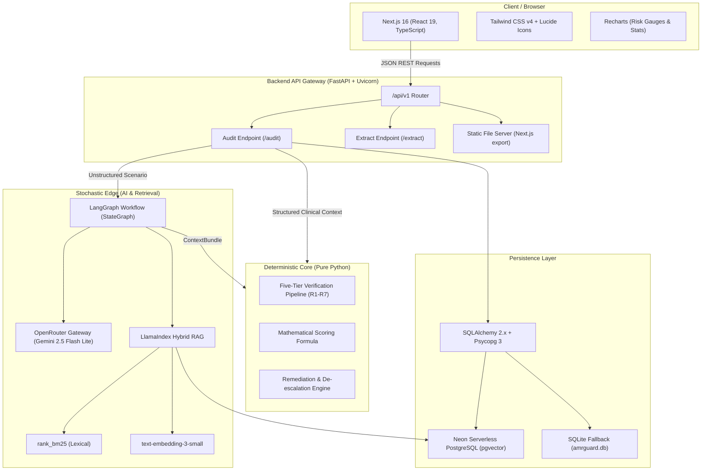

# AMR-Guard End-to-End Technology Stack & Architecture

This document provides a comprehensive specification of the technology stack, libraries, frameworks, architectural layers, and clinical datasets used to build **AMR-Guard** end-to-end.

---

## 1. Architectural Philosophy: "Stochastic Edge, Deterministic Core"

Clinical safety cannot tolerate probabilistic scoring drift or LLM hallucinations when validating prescription safety. AMR-Guard adopts a strict two-layer architectural paradigm:

```
[ Unstructured Prescription / Input ]
                 │
                 ▼
     ┌───────────────────────┐
     │    STOCHASTIC EDGE    │ ◄─── LangGraph + OpenRouter LLM + LlamaIndex RAG
     │  (Parsing & Extraction│      (Entity normalization, semantic guideline retrieval)
     └───────────┬───────────┘
                 │ Strictly Validated ContextBundle (Pydantic v2)
                 ▼
     ┌───────────────────────┐
     │  DETERMINISTIC CORE   │ ◄─── Pure Python Rules & Scoring Engine
     │   (Clinical Gates)    │      (Zero LLM imports, mathematically bounded penalties)
     └───────────┬───────────┘
                 │
                 ▼
     ┌───────────────────────┐
     │  AUDIT & TRIAGE DECISION
     │  (BLOCKED / FLAGGED / APPROVED)
     └───────────────────────┘
```

* **Stochastic Edge:** Employs LLM agents and hybrid vector/lexical retrieval to ingest noisy clinical inputs, normalize drug and condition entities, and assemble clinical context bundles.
* **Deterministic Core:** Operates strictly on deterministic Python rule trees and algebraic penalty scoring derived from clinical guidelines (ICMR STG, WHO AWaRe, ICMR-AMRSN surveillance data).

---

## 2. Architecture & Data Flow



---

## 3. End-to-End Technology Stack Breakdown

### 3.1 Frontend Web Application

| Technology / Library | Version | Role & Description |
| :--- | :--- | :--- |
| **Next.js** | `16.4.0` | React web framework using App Router. Configured for static export (`output: 'export'`) to be served directly by the FastAPI production server. |
| **React** | `19.3.0` | Component lifecycle, hooks, and UI rendering. |
| **TypeScript** | `^5` | Strict static typing for all interfaces, props, and API payloads. |
| **Tailwind CSS** | `^4` | Utility-first styling engine integrated with `@tailwindcss/turbopack`. |
| **Lucide React** | `^1.54.0` | Icon system for clinical alerts, triage badges, and navigation. |
| **Recharts** | `^3.10.1` | Interactive data visualization for antimicrobial risk gauges and surveillance statistics. |
| **clsx** & **tailwind-merge** | `^2.1.1` / `^3.7.0` | Dynamic class-name composition without style collisions. |
| **ESLint** | `^9` | Code formatting and linting (`eslint-config-next`). |

### 3.2 Backend Service & API Layer

| Technology / Library | Specification | Role & Description |
| :--- | :--- | :--- |
| **FastAPI** | Latest | Asynchronous Python framework providing REST endpoints, OpenAPI/Swagger autodocs (`/docs`), and dependency injection. |
| **Uvicorn** | `uvicorn[standard]` | ASGI web server running the FastAPI application. |
| **Python** | `>=3.10` | Base execution runtime. |
| **Pydantic** | `>=2.0` | Request/response schema definitions, validation, and JSON Schema serialization. |
| **pydantic-settings** | Latest | Environment variable ingestion from `.env` files with strict type enforcement. |
| **python-multipart** | Latest | Handling multipart form data for file and prescription uploads. |
| **python-dotenv** | Latest | Loading environment variables across scripts and server runtimes. |
| **PyYAML** | Latest | Parsing guideline indexes, validation matrices, and YAML manifests. |

### 3.3 Agentic AI & RAG Layer (Stochastic Edge)

| Technology / Library | Specification | Role & Description |
| :--- | :--- | :--- |
| **LangGraph** | Latest | Cyclical state-machine framework (`StateGraph`) defining multi-step agent workflows (analyze, search, format). |
| **OpenRouter API** | Gateway | Unified model routing gateway (`https://openrouter.ai/api/v1`) using the OpenAI SDK client interface. |
| **Foundation Model** | `google/gemini-2.5-flash-lite` | High-speed LLM for non-deterministic data normalization and schema synthesis. |
| **google-genai** | SDK | Direct Google Gemini SDK integration support. |
| **LlamaIndex** | `llama-index-core` | Document ingestion, chunking, and retrieval pipeline orchestrator. |
| **Embedding Model** | `text-embedding-3-small` | 1536-dimensional semantic vector embeddings routed through OpenRouter. |
| **llama-index-vector-stores-postgres** | Adapter | Connects LlamaIndex storage context directly to PostgreSQL vector tables. |
| **pgvector** | Extension & Python driver | Vector similarity search (cosine distance) for clinical literature retrieval. |
| **rank_bm25** | Library | Lexical BM25 keyword search used in combination with vector search for hybrid retrieval. |
| **RapidFuzz** | Latest | Ultra-fast C++ string similarity for drug brand resolution and phonetic typo tolerance. |

### 3.4 Database & Persistence Layer

| Technology / Library | Specification | Role & Description |
| :--- | :--- | :--- |
| **PostgreSQL** | Neon Serverless | Primary cloud relational database with `vector` extension support. |
| **SQLite** | `sqlite:///./amrguard.db` | Local fallback database engine for offline development and local test suites. |
| **SQLAlchemy** | `>=2.0` | ORM defining relational models: `Drug`, `Brand`, `Condition`, `Guideline`, `Rule`, `Regimen`, `Audit`. |
| **Psycopg 3** | `psycopg[binary]` | Modern Python database driver for PostgreSQL. |

### 3.5 Deterministic Clinical Verification Engine

| Component | Module | Description & Clinical Evidence Base |
| :--- | :--- | :--- |
| **Five-Tier Pipeline** | `app.engine.rules` | Evaluates prescriptions against clinical safety gates: <br>• **Tier 1:** Hard contraindications (Pediatric FQ/Tetracyclines, Pregnancy FDA Cat D/X, Geriatric Nitrofurantoin/eGFR).<br>• **Tier 2:** Indication legitimacy (Viral self-limiting gate, irrational FDC filter).<br>• **Tier 3:** WHO AWaRe spectrum escalation (Watch group de-escalation, Reserve air-gap).<br>• **Tier 4:** Therapeutic duration limits (CAP 5-day cap, UTI 1-5 day caps).<br>• **Tier 5:** Local resistance traps (ICMR-AMRSN UTI FQ penalty). |
| **Mathematical Scoring** | `app.engine.scoring` | Calculates risk score: $$AMR\_Risk\_Score = \min(100, 0.4 \cdot P_{class} + 0.2 \cdot P_{duration} + 0.4 \cdot P_{indication})$$ Assigns triage bands: `GREEN` (0–24), `AMBER` (25–49), `RED` (50–100), or `BLOCKED` (100). |
| **Remediation Engine** | `app.engine.remediation` | Proposes de-escalation substitutions and supportive therapies. |

### 3.6 Testing & Quality Assurance

| Technology / Tool | Specification | Role & Description |
| :--- | :--- | :--- |
| **Pytest** | Latest | Unit and integration test runner (`tests/test_rules.py`, `tests/test_scoring.py`, `tests/test_normalizer.py`). |
| **HTTPX** | Latest | Asynchronous HTTP client for API integration tests (`tests/test_audit_api.py`). |
| **AST Conformance Check** | `tests/test_architecture.py` | Python AST parser that statically verifies that `app/engine` never imports from LLM agents or external AI SDKs. |

### 3.7 DevOps & Task Automation

| Tool | Specification | Role & Description |
| :--- | :--- | :--- |
| **GNU Make** | `Makefile` | Standard command recipes: `install`, `dev-backend`, `dev-frontend`, `build-frontend`, `run`, `seed`, `ingest-okf`, `ingest-knowledge`, `test`. |
| **Git** | Version Control | Source code and clinical knowledge dataset version control. |

---

## 4. Primary Clinical Knowledge Datasets

The deterministic rules and vector knowledge base are grounded in official Indian and international clinical surveillance records:

1. **ICMR Standard Treatment Guidelines (STG):** Outpatient pediatric, adult respiratory, and urological infection management guidelines.
2. **WHO AWaRe Classification (2023):** Access, Watch, and Reserve antimicrobial categories.
3. **ICMR-AMRSN Annual Reports:** Surveillance data documenting resistance levels (e.g., >75% Fluoroquinolone resistance in outpatient *E. coli*).
4. **NCDC NARS-Net Reports (2017–2020):** National Programme on AMR Containment resistance tracking data.
5. **Beers Criteria:** Geriatric medication contraindications.
